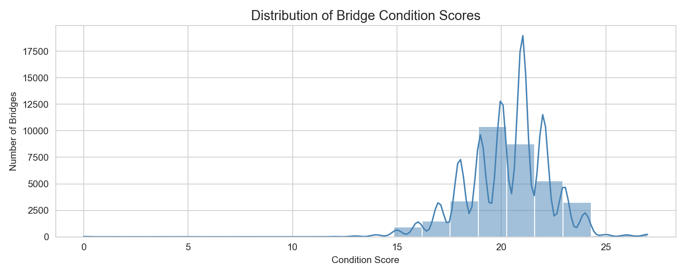

# Exploratory Analysis and Regression Modelling of Texas Bridge Data

<p align="center">
  
</p>

<p align="center">
  
  
  
  
  
  
</p>

> A statistical regression analysis of 34,293 bridges from the Texas Department of Transportation (TxDOT) Bridge Inventory Dataset (2019), identifying which structural and operational factors best predict bridge condition.

---

## Table of Contents

- [Project Overview](#project-overview)
- [Dataset](#dataset)
- [Methodology](#methodology)
- [Findings](#findings)
- [Requirements](#requirements)
- [How to Run](#how-to-run)
- [Limitations](#limitations)

---

## Project Overview

This project examines the factors that contribute to the structural deterioration of bridges across Texas. Using the TxDOT 2019 Bridge Inventory, we examine five candidate predictors: **bridge age**, **average daily traffic**, **truck percentage**, **construction material**, and **structural design**. And determine which best explains variation in a composite **Condition Score** (0–27).

The analysis follows a three-stage pipeline:

1. **Data Preparation:** feature engineering, missing value handling, categorical simplification, and exclusion of historic bridges (>100 years old)
2. **Exploratory Data Analysis (EDA):** distributions, scatter plots, Pearson correlations, ANOVA tests, and cross-tabulations
3. **Regression Modelling:** OLS linear regression with dummy encoding, residual diagnostics, and standardised coefficients for predictor comparison

---

## Dataset

| Property | Detail |
|---|---|
| Source | Texas Department of Transportation (TxDOT) |
| Year | 2019 |
| Raw records | 34,293 bridges |
| Records after cleaning | 33,970 bridges |
| Key variables used | `Year`, `AverageDaily`, `Truckspercent`, `Material`, `Design`, `Deckrating`, `Superstrrating`, `Substrrating` |

> **Note:** The dataset file `tx19bridges-sample.csv` is required to run the notebook. Place it in the root directory.

---

## Methodology

### Feature Engineering
- **Age**: Derived as `2025 − Year` to capture cumulative wear since construction
- **Condition Score**: Sum of three inspector ratings (Deck, Superstructure, Substructure), each on a 0–9 scale, yielding a continuous 0–27 composite

### Data Cleaning
- Rows with missing rating data dropped (7 records, <0.02% of data)
- Bridges older than 100 years are excluded to avoid distortion from heritage maintenance regimes
- Rare categorical levels (Masonry material; Arch, Frame, Movable, Suspension, Truss designs) merged into `Other` to prevent unstable coefficient estimates

### Exploratory Analysis
- Pearson correlation and p-values for continuous predictors
- One-way ANOVA for categorical predictors
- Heatmap of pairwise predictor correlations
- Cross-tabulation of Material × Design

### Regression Model
- OLS Linear Regression 
- Categorical variables dummy-encoded (reference: Concrete material, Beam design)
- Model evaluated with **R²** and **MSE**
- Standardised model fitted to compare predictor influence on equal footing

---

## Findings

| Predictor | Relationship | Strength |
|---|---|---|
| Age | Negative (older → worse condition) | Strongest predictor (35% of variance) |
| Average Daily Traffic | Negligible | Not significant |
| Truck Percentage | Negligible | Not significant |
| Material (Concrete vs Steel) | Concrete associated with better condition | Moderate |
| Design type | Beam/Slab outperform others | Moderate |

- **Model R²: 0.4541**. Age, material, and design together explain 45% of condition variance
- **MSE: 2.1590**
- Traffic-related variables show near-zero correlation with condition, suggesting load volume alone is not a reliable predictor of structural deterioration

---

## Requirements

∙ Python 3.8+

∙ pandas

∙ numpy

∙ matplotlib

∙ seaborn

∙ scipy

∙ scikit-learn


Install all dependencies with:

```bash
pip install pandas numpy matplotlib seaborn scipy scikit-learn
```

---

## How to Run

1. Clone the repository:
   ```bash
   git clone https://github.com/cipriano-sebastiao/texas-bridge-analysis.git
   cd your-repo-name
   ```

2. Ensure `tx19bridges-sample.csv` is in the root directory

3. Launch the notebook:
   ```bash
   jupyter notebook notebook.ipynb
   ```

4. Run all cells in order (`Kernel > Restart & Run All`)

---

## Limitations

- **Univariate scope**: The EDA treats predictors largely in isolation; interaction effects (e.g., age × material) are not modelled
- **R² ceiling**: The model explains 45% of variance, suggesting important predictors may be missing (e.g., maintenance history, climate zone, inspection frequency)
- **Cross-sectional data**: A single year snapshot cannot capture longitudinal deterioration trajectories
- **Sparse design categories**: Several structural design types had too few observations for reliable independent estimation

---
